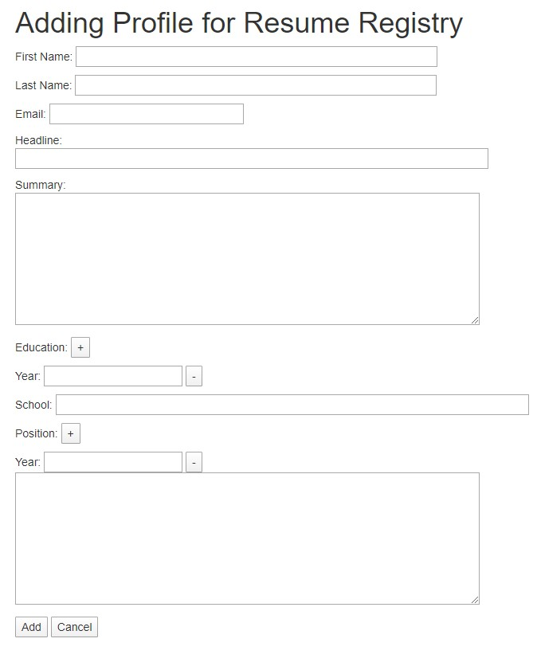

# Resume-Registry
Simple PHP CRUD application for resume registry

## Getting started
1. Add **resume.sql** to your database as *'resume'*
2. Configure **pdo.php**
3. Launch application in your server

## Features
* Login to resume registry application:
Email: **resume@registry.com**
Password: **php123**

* Add resmue:

